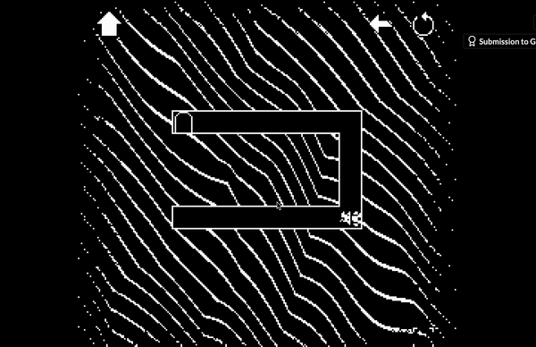
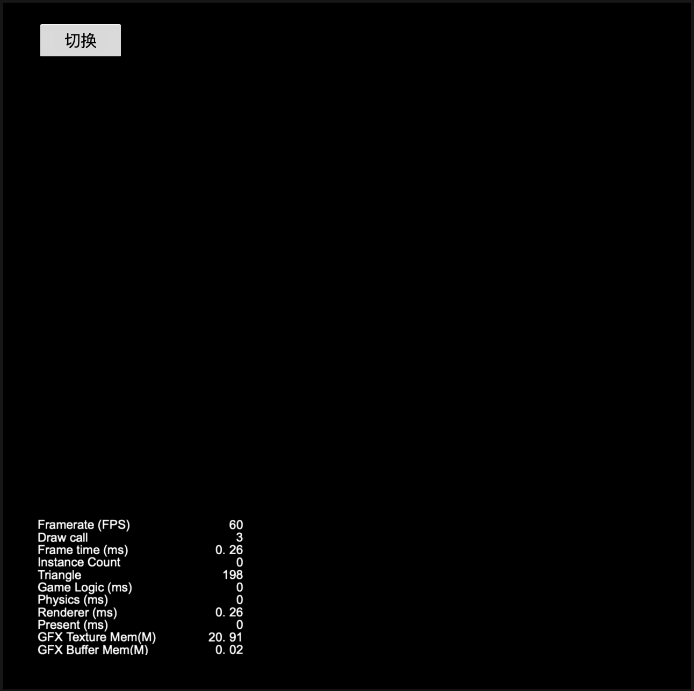

# JellyWall But Mask

基于 CocosCreator，尝试通过 Mask 组件的方式来实现 “果冻墙” 效果。

结论：能够实现。

优点
1. 简单、方便。

缺点
1. drawcall 较多，每一个 cell 需要增加 3 drawcall。

## 什么是“果冻墙”

[A.F.K protocol](https://jellbot.itch.io/afk-protocol)

1. “墙块”可以拖动。
2. 松手后复位。
3. 拖动过程中能够正常透视底图。

## 实验报告

| 情况  | DrawCall  |
|---|---|
| 一个切换按钮 | 3 |
| ➕一个中间挖空的底图 | 6 |
| ➕一个 果冻墙 块 | 9 |
| ➕三个 果冻墙 块 | 18 |

各情况截图如下

